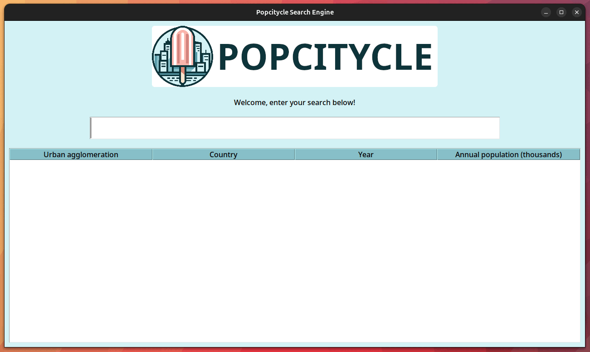

# Tkinter Search Engine

This is inspired by a side project I carried out a few years ago in one of my previous professional endeavours. The main objective was to automate the repetitive tasks of searching for information in public/online and internal/local "databases" taking the form of Excel files. The data would, of course, evolve over time.

This reproduces some features of the developped solution, and in particular the approximate string matching algorithm which is both simple and quite effective.

Annual population data for major urban areas as provided by the United Nations are taken as an example.

<div align="center">
  <p></p>
  <p>Screenshot of the app'</p>
</div>

## Dependencies

The code is designed to minimize the use of third-party libraries. It mainly relies on `tkinter`, which is the GUI library included with standard installs of Python.

Excel file reading is done with `openpyxl`, which can be installed with:
```
pip install openpyxl
```

## Aknowledgement

The following book has been a great source of inspiration: Moore, A. D. (2021). *Python GUI Programming with Tkinter: Design and build functional and user-friendly GUI applications*. Packt Publishing Ltd.
